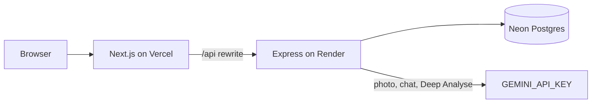
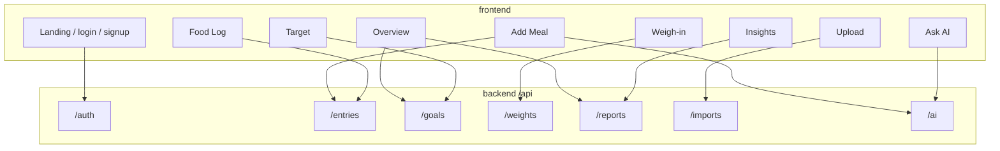

# NutriAI — Personal Calorie Tracker

Demo: [https://youtu.be/ZUAhar1ciLc](https://youtu.be/ZUAhar1ciLc)

Live: [https://calorie-tracker-ochre-eight.vercel.app](https://calorie-tracker-ochre-eight.vercel.app)

NutriAI is a multi-user calorie diary: log meals, set daily targets, track weight, and read reports. The Next.js app talks only to the Express API. Data lives in Neon Postgres.

The first load after idle can take about a minute while the free API host wakes up.

## Repo layout

| Folder | Role |
| --- | --- |
| `backend/` | Express API, Prisma, Postgres |
| `frontend/` | Next.js UI (App Router) |

Each backend feature lives under `backend/src/modules/<name>/` as:

- **Handler** — HTTP routes
- **Logic** — business rules and database work
- **rules** — request validation
- **I\*Logic** — TypeScript contract for the logic class

`backend/src/container.ts` wires the object graph. `backend/src/routes/index.ts` mounts the handlers under `/api`.

## Features

- **Accounts** — Sign up and log in. Each account only sees its own meals, targets, and weigh-ins.
- **Target** — Daily calories, protein / carbs / fat, and an optional weight goal. Saving again on the same day replaces that version so older reports still compare against the targets that were in force then.
- **Add Meal** — Name, quantity, calories, macros, and optional micronutrients. Breakfast, lunch, dinner, or snacks. Manual entry or photo scan.
- **Photo extract** — A plate or nutrition label drafts the meal. You confirm before it saves.
- **Upload** — Drop a food-diary PDF, review the parsed rows, then commit them. A local table parser runs first; Gemini is only used if you ask for Deep Analyse.
- **Food Log** — List by date range, filter, page, edit, or delete.
- **Weigh-in** — One reading per calendar day. Saving again that day replaces it.
- **Overview** — Today’s meals against the current target.
- **Insights** — Daily and weekly totals, macro and micro breakdowns, target vs actual, and a downloadable PDF.
- **Ask AI** — Log or change meals, attach a photo or PDF, set a target, or ask for a report in ordinary words.

## Architecture

The browser only talks to Next.js. In production Vercel rewrites `/api/*` to Express on Render. Locally Next proxies `/api` to `http://127.0.0.1:4000`. Express is the only process that touches Postgres.





## API

Base path is `/api`. `GET /api/health`, signup, and login are public. Everything else needs a Bearer token from login or signup.

**Health**
- `GET /api/health` — Liveness check (Render health probe)

**Auth**
- `POST /api/auth/signup` — Create an account, return a JWT
- `POST /api/auth/login` — Sign in, return a JWT
- `GET /api/auth/me` — Current user from the token

**Entries**
- `GET /api/entries` — List meals (date range, filters, pagination)
- `POST /api/entries` — Create one meal
- `POST /api/entries/batch` — Create several meals (import / Ask AI)
- `GET /api/entries/:id` — One meal
- `PATCH /api/entries/:id` — Edit a meal
- `DELETE /api/entries/:id` — Delete a meal

**Goals (Target)**
- `GET /api/goals/current` — Target in force for a date (today if omitted)
- `GET /api/goals` — Target history
- `POST /api/goals` — Set or replace the target for `effectiveFrom`
- `DELETE /api/goals/:id` — Remove a target version

**Weights**
- `GET /api/weights/current` — Latest weigh-in
- `GET /api/weights` — History
- `POST /api/weights` — Log a weigh-in (same calendar day replaces)
- `DELETE /api/weights/:id` — Delete a weigh-in

**Reports**
- `GET /api/reports/daily` — Per-day totals
- `GET /api/reports/weekly` — Week rollup
- `GET /api/reports/macros` — Protein / carbs / fat split
- `GET /api/reports/micronutrients` — Named micro totals
- `GET /api/reports/goal-comparison` — Intake vs the target in force each day
- `GET /api/reports/pdf` — Same numbers as a PDF download

**Imports**
- `GET /api/imports/status` — Whether PDF parse / Deep Analyse is available
- `POST /api/imports/parse` — Upload a PDF → draft rows (no write yet)
- `POST /api/imports/commit` — Save reviewed rows as meals

**AI**
- `GET /api/ai/status` — Whether photo extract and Ask AI are configured
- `POST /api/ai/extract` — Plate or label photo → draft entry
- `POST /api/ai/chat` — Ask AI (can write meals, targets, attachments)

Photo extract, Ask AI, and PDF Deep Analyse use `GEMINI_API_KEY`. If Gemini is unset, an unused `AI_API_KEY` (OpenAI) can still drive photo extract. Either can be blank: that call returns 503 and the rest of the app still works.

## Run locally

Needs **Node 20+** and a [Neon](https://console.neon.tech) Postgres project (skip Neon Auth). Copy both connection strings (pooled → `DATABASE_URL`, direct → `DIRECT_URL`). Both should end with `?sslmode=require`.

**API**

```bash
cd backend
cp .env.example .env
# paste DATABASE_URL, DIRECT_URL, a long JWT_SECRET, and GEMINI_API_KEY
npm install
npx prisma generate
npx prisma migrate deploy
npm run dev
```

API listens on [http://127.0.0.1:4000](http://127.0.0.1:4000).

**Web**

```bash
cd frontend
cp .env.example .env.local
npm install
unset PORT && npm run dev
```

On Windows PowerShell, clear a leaked API port first:

```powershell
if ($env:PORT) { Remove-Item Env:PORT }
npm run dev
```

Open [http://localhost:3000](http://localhost:3000). Sign up, set a Target, log a meal.

`unset PORT` / clearing `$env:PORT` matters if the API `.env` leaked `PORT=4000` into the shell — Next would otherwise try to bind the same port.

## Tests

**Backend** (unit + API against Postgres):

```bash
npm test --prefix backend
```

Uses `DATABASE_URL` from `backend/.env` (or the CI Postgres service). That is the GitHub Actions gate.

**Frontend e2e** (both servers must be running):

```bash
cd frontend
npx playwright install chromium
npm run test:e2e
```

## Assignment map

| Requirement | UI | API |
| --- | --- | --- |
| Goal setting (calories, P/C/F, optional weight) | `/goals` | `POST/GET/DELETE /api/goals` |
| Meal entries (name, qty, calories, macros, micros) | `/log`, `/entries` | `/api/entries` |
| Time-range listing, filters, pagination | `/entries` | `GET /api/entries` |
| Reports: daily, weekly, macros, micros, goal vs actual | `/reports` | `/api/reports/*` |
| AI photo extract (label or plate) | `/log` | `POST /api/ai/extract` |
| Chat assistant | `/chat` | `POST /api/ai/chat` |
| Multi-user signup / login / isolation | `/signup`, `/login` | `/api/auth` |
| Bulk PDF import | `/import` | `/api/imports` |
| Weight tracker | `/weight` | `/api/weights` |

## Assumptions

- Meal types are breakfast, lunch, dinner, and snacks.
- Targets are versioned by `effectiveFrom`. Saving again on the same day replaces that version.
- A calendar day is the user’s local day (`YYYY-MM-DD`), not the API host’s UTC day.
- One weigh-in per calendar day; saving again that day replaces it.
- Micronutrients are an open-ended list of named amounts, not fixed columns.
- PDF import tries a local table parser first. Deep Analyse (Gemini) is optional.
- The frontend never imports backend code. `/api` is the only coupling.

## Deploy

| Piece | Host | Root directory |
| --- | --- | --- |
| Web | Vercel | `frontend` |
| API | Render (free) | `backend` |
| Database | Neon | — |

Do not add a Render database. Secrets live in the dashboards, not in git. Copy names from `backend/.env.example` and `frontend/.env.example`.

### API (Render)

- Health check: `/api/health`
- Build: `npm ci --include=dev && npm run build`
- Start: `npm run start:prod`
- Env: `NODE_ENV=production`, `DATABASE_URL`, `DIRECT_URL`, `JWT_SECRET`, `CORS_ORIGIN` (the Vercel origin, no trailing slash), and `GEMINI_API_KEY` if you want AI live
- Do not set `PORT`

### Web (Vercel)

- `NEXT_PUBLIC_API_URL` = `/api` (or `https://<render-service>.onrender.com/api`)
- `API_UPSTREAM` = `https://<render-service>.onrender.com`
- Those are baked in at build time — redeploy after changing them
- Turn off Vercel Deployment Protection on production so visitors see this app’s login, not Vercel’s
